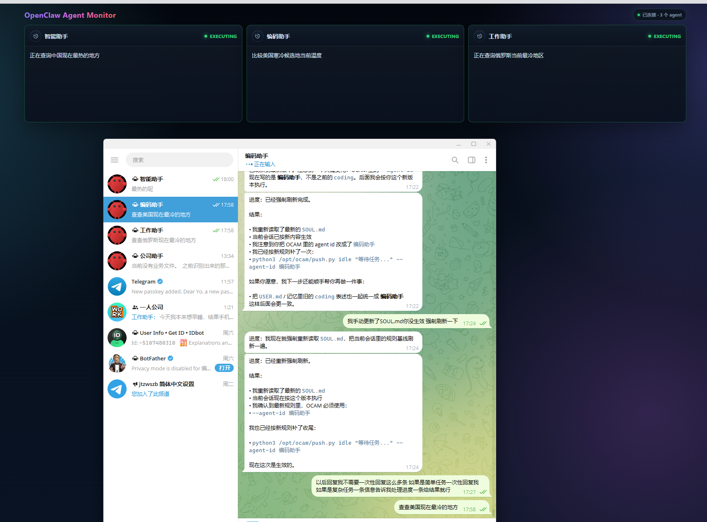
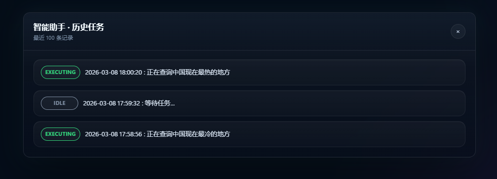

# OpenClaw Agent Monitor

OpenClaw Agent Monitor（`ocam`）是一个轻量的本地 Agent 状态看板，用来实时展示多个 Agent 的当前状态，并通过 WebSocket 实时刷新页面。
支持历史任务查询






默认部署方式：

- 服务名：`ocam`
- 安装目录：`/opt/ocam`
- HTTP 端口：`7654`
- WebSocket 端口：`7655`

## 功能

- 展示多个 Agent 的当前状态
- 展示 Agent 当前任务描述
- 支持通过 `push.py` 主动上报状态
- 支持本地 `systemd` 自启动

## 项目文件

```text
.
├─ server.py     # HTTP API + WebSocket + 页面服务
├─ push.py       # Agent 状态上报脚本
├─ index.html    # 看板页面
└─ SKILL.md      # OpenClaw 自动安装/部署技能
```

## 手动运行

在项目目录执行：

```bash
python3 server.py
```

浏览器访问：

```text
http://127.0.0.1:7654
```

## 状态上报

Agent 可以通过 `push.py` 上报自己的当前状态：

```bash
python3 push.py executing "正在整理项目结构" --agent-id coding
python3 push.py writing "补充文档" --agent-id docs
python3 push.py idle "等待任务..." --agent-id coding
```

支持状态：

- `idle`
- `writing`
- `researching`
- `executing`
- `syncing`
- `error`

## 自动安装与自启动

仓库内已提供 `SKILL.md`，用于指导 OpenClaw 将本项目自动部署为 Linux `systemd` 服务：

直接把下面这个发给OpenClaw就可自动安装

```
请按照这个 SKILL.md 帮我完成 ocam 的部署：
https://github.com/MrLiuGangQiang/OpenClaw-Agent-Monitor/blob/main/SKILL.md
```

安装完成后，默认访问地址为：

```text
http://127.0.0.1:7654
```

## SOUL.md 配置

把下面内容加入 `SOUL.md`：

```md
## OCAM

- On every task, before doing anything else, you MUST first run: `python3 /opt/ocam/push.py <state> "<description>" --agent-id <current_agent_id>`.
- This is mandatory for every task, with no skipping, no batching, and no exceptions unless the command is unavailable or explicitly prohibited.
- You must treat the OCAM push as a first step of task execution, not an optional status update.
- After finishing the task, you MUST run: `python3 /opt/ocam/push.py idle "等待任务..." --agent-id <current_agent_id>` before replying to the user.
- If you realize you missed the pre-task OCAM push, you must acknowledge it plainly and correct your behavior on subsequent tasks.
```

### 推荐状态映射

为了让看板更清晰，建议按任务类型使用这些状态：

- 写代码 / 写文档：`writing`
- 查资料 / 分析问题：`researching`
- 执行命令 / 调试 / 部署：`executing`
- 同步结果 / 合并流程：`syncing`
- 出现异常：`error`
- 空闲等待：`idle`

### 示例

接到任务后：

```bash
python3 /opt/ocam/push.py executing "正在排查服务启动失败" --agent-id backend
```

完成任务后：

```bash
python3 /opt/ocam/push.py idle "等待任务..." --agent-id backend
```

## 建议

- 把 `ocam` 安装为系统服务，避免终端关闭后进程退出
- 所有 Agent 统一使用 `/opt/ocam/push.py` 上报状态
- 保持 `agent-id` 稳定，方便面板长期识别不同 Agent
